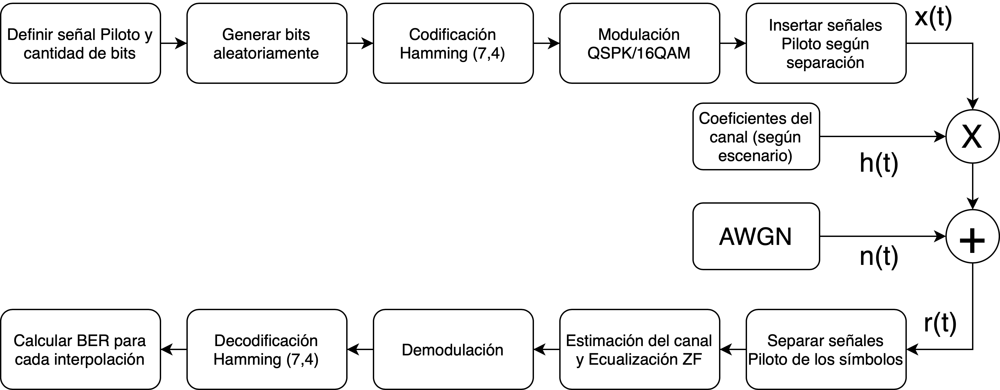

# Rayleigh Channel Model

Simulación de un canal de Rayleigh que hace uso de MATLAB. Se simulan un total de 81 escenarios, variando el comportamiento del canal, la distancia de los símbolos pilotos y la modulación utilizada (16QAM, 8PSK, QPSK).

El objetivo de la simulación es calcular las curvas de BER vs $\frac{E_b}{N_0}$ para valores de SNR en [-2, 30] dB, cada escenario se simula un total de 21 veces para que sea estadísticamente representativo. 

## Diagrama de flujo de la simulación

